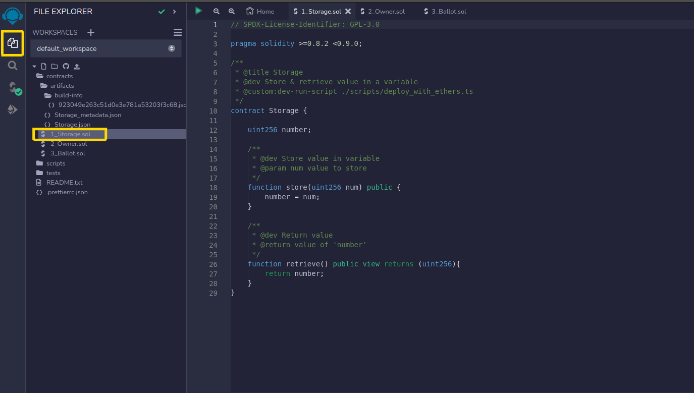
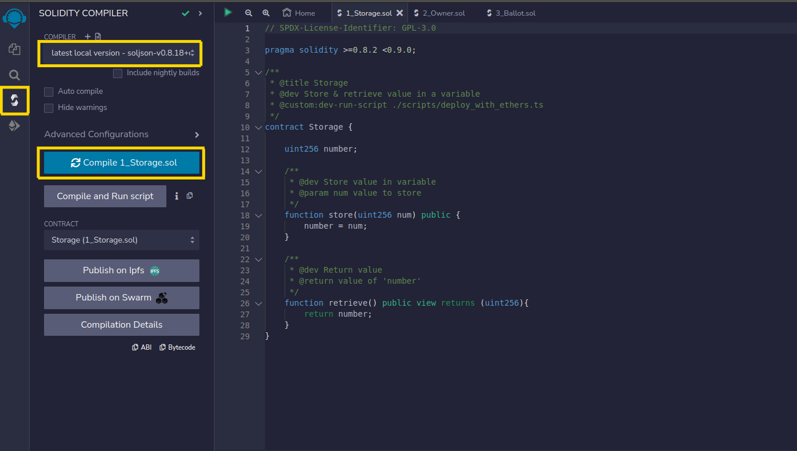
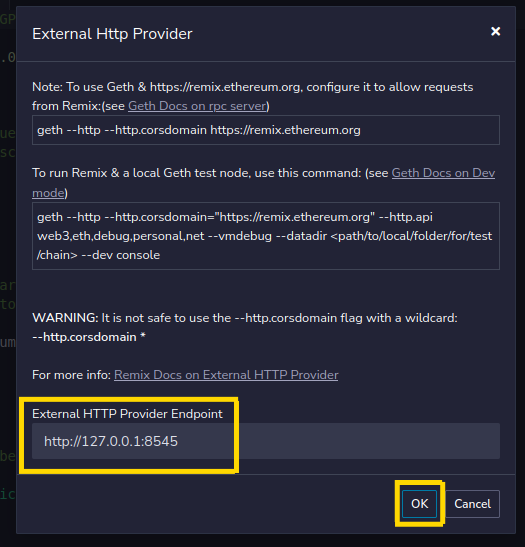
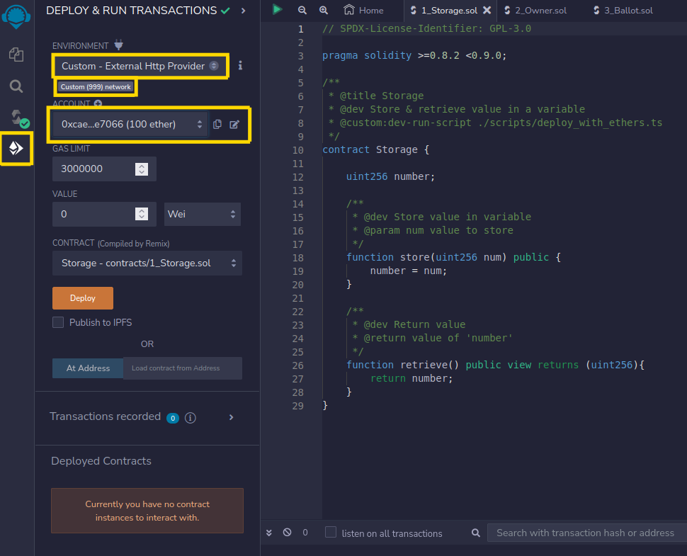
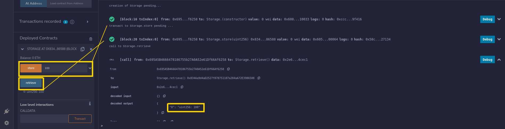

# Despliegue Red Privada Ethereum

En este documento se describirán los pasos para desplegar una red privada Ethereum localmente, de modo que se pueda disponer de una red frente a la que realizar todo tipo de pruebas.


# Instalación de Go Ethereum

Es una herramienta de línea de comandos multipropósito que ejecuta un nodo Ethereum completo.Ofrece múltiples interfaces: los sub-comandos y opciones de la línea de comandos, un servidor JSON-RPC y una consola interactiva.

Esta herramienta nos facilitará en gran medida la creación de nuestra red Ethereum.Vamos a intentar mantenerlo todo en un entorno local, para ello:
1. Crearemos el siguiente árbol de directorios dentro de un directorio llamado 'test_ethereum/'
```bash
    .
    ├── binaries
    ├── Caliper
    └── PrivateChain
        ├── data_directory
        └── genesis
```
2. Descargaremos el binario de su pagina oficial:
https://geth.ethereum.org/downloads
3. Descomprimiremos su contenido dentro del directorio 'binaries':
```bash
    tar -zxvf <nombre-comprimido> <ruta>/binaries/
```


# Configurando la BlockChain privada

Vamos a crear un caso de uso simple. Desplegaremos una red con 2 nodos 

1. El primer paso consiste en crear un fichero JSON que define la configuración inicial de la red, esto es, los ficheros de génesis que definen la información que contendrá el primer bloque de la red. Para ello, crearemos un fichero `genesis.json` dentro de `./PrivateChain/genesis/` con el siguiente contenido:
```json
    {
        "config": {
            "chainId": 999,
            "homesteadBlock": 0,
            "eip150Block": 0,
            "eip155Block": 0,
            "eip158Block": 0,
            "byzantiumBlock": 0,
            "constantinopleBlock": 0
        },
        "difficulty": "0x400",
        "gasLimit": "0x80000000000000",
        "alloc": {}
    }
```
**Nota**: Para mas información sobre estos parámetros, consultar aquí: https://merehead.com/blog/how-to-create-private-ethereum-blockchain/#content_6
Los 2 últimos, `byzantiumBlock` y `constantinopleBlock` son obligatorios para trabajar con contratos inteligentes.

# Levantando un nodo para nuestra BlockChain privada

1. Continuación vamos utilizar este fichero para generar nuestro bloque, y lo hacemos ejecutando el siguiente comando
```bash
./binaries/geth --datadir ./PrivateChain/data_directory/ --identity jdm93 init ./PrivateChain/genesis/genesis.json
```
2. Hemos creada el bloque de genesis, ahora toca poner en marcha la red con el siguiente comando:
```
./binaries/geth --datadir ./PrivateChain/data_directory/ --networkid 999
```
3. Una vez hemos desplegado la red, vamos, desde otra ventana, a conectarnos a ella para diferentes consultas con el siguiente comando:
```bash
./binaries/geth attach ./PrivateChain/data_directory/geth.ipc 
```

# Agregando actores a nuestra BlockChain privada

1. Para crear actores bastará con ejecutar el siguiente comando tantas veces como usuarios queramos interactuando en nuestra red:
```
./binaries/geth --datadir ./PrivateChain/data_directory/ account new
```
**NOTA**: En este ejemplo, se crearon 2 usuarios. Es importante guardar los siguientes datos:
    - Usuario 1:
      - Public address: `0xcaec347FF2a1C6424bAFEF01C3d65ce6760e7066`
      - Secret Key File: `./PrivateChain/data_directory/keystore/UTC--2023-03-01T12-31-59.471051432Z--caec347ff2a1c6424bafef01c3d65ce6760e7066`
      - Password used: `1234`
    - Usuario 2:
      - Public address: `0xAc65651FCEf66958189D33cadbcF466B8Fd145f1`
      - Secret Key file: `./PrivateChain/data_directory/keystore/UTC--2023-03-01T12-33-56.626622434Z--ac65651fcef66958189d33cadbcf466b8fd145f1`
      - Password used: `4321`
2. Podemos comprobar que se han creado correctamente con el comando `get attach` y:
```javascript
> eth.accounts
["0xcaec347ff2a1c6424bafef01c3d65ce6760e7066", "0xac65651fcef66958189d33cadbcf466b8fd145f1"]
```

# Modificando nuestra blockChain

Si preguntamos por el balance de cualquiera de los usuarios que hemos creado anteriormente podemos ver que tienen 0:
```javascript
> eth.getBalance(eth.accounts[0])
0
> eth.getBalance(eth.accounts[1])
0
```

Para empezar una economía dentro de nuestra red privada, vamos a hacer que el primer usuario se ponga a minar:
```javascript
> miner.setEtherbase(eth.accounts[0])
true
> miner.start(1)
null
```

Como la complejidad de nuestra red es muy baja, nuestro minero obtendrá una cantidad de Wei al cabo de pocos segundos:
```javascript
> miner.stop()
null
> eth.getBalance("0xcaec347ff2a1c6424bafef01c3d65ce6760e7066")
25000000000000000000
```
**NOTA:** 25000000000000000000 Wei == 25 ETH

Dado que 

Vamos a repartir un poco la riqueza de nuestro primer usuario al segundo. Dado que nuestra red esta corriendo en una red estándar, no podremos realizar una transacción porque nuestro nodo sencillo no entenderá las direcciones publicas que le pasemos. Por lo tanto, en la primera ventana deberemos parar la red y volver a levantarlo pero dentro de un nodo archivo (un nodo que no solo guardará el bloque entero, pero los parches que provocan los sucesivos cambios en el bloque). Para realizar lo anterior:
```
./binaries/geth --datadir ./PrivateChain/data_directory/ --networkid 999 --rpc.enabledeprecatedpersonal -syncmode=full -gcmode=archive -allow-insecure-unlock 
```
**NOTA**: `--rpc.enabledeprecatedpersonal` es la parte mas importante, pues nos permite acceder a `personal` namespace, necesario para poder loguearse y realizar las transacciones directamente desde la consola Javascript. Lo mismo con `-allow-insecure-unlock` pues nos permitirá desde peticiones HTTP, desbloquear un usuario para loguearse en él

Ahora, volviendo a ejecutar un `geth attach` ejecutaremos dentro de la consola:
```javascript
> web3.personal.unlockAccount(eth.accounts[0],"1234",15000)
true
> eth.sendTransaction({
  from: eth.accounts[0],
  to: eth.accounts[1],
  value: web3.toWei(10, 'ether')
});
```

Para que la transacción se suceda, esta debe ser "minada" (un usuario de la red debe dar su capacidad de computo para que se produzca la transacción):
```javascript
> miner.setEtherbase(eth.accounts[0])
true
> miner.start(1)
null
```

Dejamos unos segundos para que el minado se produzca y luego lo paramos:
```javascript
> miner.stop()
null
```
Y ahora si comprobamos el balance de nuestro segundo usuario, veremos que tiene los 10 ETH(==10000000000000000000 Wei) que le hemos transferido anteriormente:
```javascript
eth.getBalance(eth.accounts[0])
10000000000000000000
```

# Desplegando contratos inteligentes

## Desde Remix.Ethereum.org

Ahora viene la parte mas importante. El despliegue de contratos inteligentes. Antes de continuar, vamos a tumbar el nodo que mantiene la red arriba y vamos a volver a levantarla pero con la siguiente configuración:
```bash
./binaries/geth --datadir ./PrivateChain/data_directory/ --networkid 999 --rpc.enabledeprecatedpersonal -allow-insecure-unlock --http --http.corsdomain="https://remix.ethereum.org" --http.api web3,eth,debug,personal,net --vmdebug
```
El flag `--http.corsdomain` será útil porque es desde esa pagina donde desplegaremos un contrato inteligente y necesitamos habilitar la opción de peticiones entre dominios para que la pagina pueda desplegar el contrato en nuestra red.

El proceso es sencillo:
1. Seleccionamos un contrato en la ventana `File Explorer` , tal cual se muestra en la imagen:

2. Seleccionamos la ventana `Solidity Compiler`. Compilamos ese contrato seleccionando la versión de compilador que queramos (`latest` para este ejemplo):

3. Seleccionamos la ventana `Deploy & run transactions`. Luego seleccionamos `Environment --> Custom - External Http Provider` y a la ventana emergente que sale, confirmamos que en `External HTTP Provider Endpoint` se encuentra la dirección de escucha de nuestra red correctamente y pulsamos sobre el botón `Ok`:

4. Se nos debería rellenar los datos de abajo con datos de nuestra red (como id de nuestra red, que es `999`) y la lista de cuentas de la red así como el Ether del que disponen:

5. Si le diesemos al boton `Deploy` nos saltaría un error("creation of Storage errored: authentication needed: password or unlock"). Como con el envió de transacciones realizado en el paso previo, debemos:
   1. Desbloquear un usuario. Nos movemos a una ventana con `geth attach` y ejecutamos:
   ```javascript
   > web3.personal.unlockAccount(eth.accounts[1],"4321",15000)
    true
   ```
   2. Pulsamos sobre el botón `Deploy` y en la consola de "remix.ethereum.org" debería aparecer lo siguiente:
   ```bash
   creation of Storage pending...
   ```
   3. Como vemos, no avanza, y eso es porque esta pendiente de que se procese la transacción, con lo cual, debemos habilitar algún usuario para que se ponga a minar:
   ```javascript
   > miner.setEtherbase(eth.accounts[1])
    true
    > miner.start(1)
    null
   ```
   4. Si todo ha salido exitosamente, deberíamos obtener algo como lo siguiente en la consola de la pagina "remix.ethereum.org":
   ```bash
    Status not available
    [block:23 txIndex:0]
    from: 0xcae...e7066
    to: Storage.(constructor)
    value: 0 wei
    data: 0x608...10033
    logs: 0
    hash: 0x244...f05de
    transaction hash	0x23fe5fdd4739bdd09c7b90dac2a269a513d3e22ca40d69a722ccb1dd37e655e0
    from	0xcaec347FF2a1C6424bAFEF01C3d65ce6760e7066
    to	Storage.(constructor)
    gas	142461 gas
    transaction cost	142461 gas 
    input	0x608...10033
    decoded input	{}
    decoded output	 - 
    logs	[]
    val	0 wei
   ```
   5. El contrato inteligente es un contrato simple que sirve para guardar el estado de una entidad. Podemos ejecutar los métodos "store" (para almacenar un uin256 en BD) o "retrieve" desde la pagina y ver sus resultados:
   
   **NOTA:** Recordar que para ejecutar todas estas transacciones es necesario mínimo un minero que done su capacidad de computo para realizarlas.

Para mas datos de como manejar los contratos inteligentes desde la consola JavasCript:
https://geth.ethereum.org/docs/interacting-with-geth/javascript-console-contracts


## Desde consola interactiva 

El primer paso para desplegar contratos inteligentes consiste en escribirlos.
Vamos a crear un contrato simple con el siguiente contenido dentro de la carpeta `./PrivateChain/Solidity/smart_contracts/`:

```solidity
// SPDX-License-Identifier: GPL-3.0-or-later
pragma solidity ^0.8.0;

contract Storage{

    uint256 value = 5;

    function set(uint256 number) public{
        value = number;
    }

    function retrieve() public view returns (uint256){
        return value;
    }
}
```

El siguiente paso consiste en compilarlo. Este proceso creará 2 salidas, un documento [ABI](https://geth.ethereum.org/docs/tools/abigen) y el propio contrato en bytecode.  
1. Para compilar necesitamos el compilador de Solidity denominado `solc` en local:
```bash
cd ./PrivateChain/Solidity; npm init; npm install solc
```
2. Una vez instalado, procedemos a compilar el contrato generando tanto el ByteCode como el ABI:
```bash
npx solc --bin smart_contracts/Storage.sol -o build
npx solc --abi smart_contracts/Storage.sol -o build
```
3. Esto habrá creado 2 ficheros dentro de la carpeta `./PrivateChain/Solidity/build/`:
```bash
build/
├── smart_contracts_Storage_sol_Storage.abi
└── smart_contracts_Storage_sol_Storage.bin
```
4. Ya tenemos los recursos necesarios para desplegar nuestro contrato. Nos volvemos a nuestra consola javascript interactiva o abrimos una nueva:
```bash
./binaries/geth attach ./PrivateChain/data_directory/geth.ipc 
```
5. Por conveniencia, vamos a introducir todos los datos de nuestro contrato como variables (copiamos el contenido de los ficheros listados anteriormente):
```javascript
var abi = [{"inputs":[],"name":"retrieve","outputs":[{"internalType":"uint256","name":"","type":"uint256"}],"stateMutability":"view","type":"function"},{"inputs":[{"internalType":"uint256","name":"number","type":"uint256"}],"name":"set","outputs":[],"stateMutability":"nonpayable","type":"function"}];
var byte_code = '0x6080604052600560005534801561001557600080fd5b50610150806100256000396000f3fe608060405234801561001057600080fd5b50600436106100365760003560e01c80632e64cec11461003b57806360fe47b114610059575b600080fd5b610043610075565b60405161005091906100a1565b60405180910390f35b610073600480360381019061006e91906100ed565b61007e565b005b60008054905090565b8060008190555050565b6000819050919050565b61009b81610088565b82525050565b60006020820190506100b66000830184610092565b92915050565b600080fd5b6100ca81610088565b81146100d557600080fd5b50565b6000813590506100e7816100c1565b92915050565b600060208284031215610103576101026100bc565b5b6000610111848285016100d8565b9150509291505056fea26469706673582212209a24f6ba440a57278cf70c9d649febe5a48d59b15d86eb0d06d99a638aa674fc64736f6c63430008130033'
```
6. Vamos a crear un *constructor de instancias* del contrato que nos servirá tanto para despegarlo como para invocarlo más adelante:
```javascript
var contract = eth.contract(abi);
```
7. Creamos los datos necesarios para la transacción, la realizamos:
```javascript
var gas = eth.estimateGas({ data: byte_code });
var tx = { from: eth.accounts[0], data: byte_code, gas: gas };
web3.personal.unlockAccount(eth.accounts[0],"1234",15000)
var deployed_contract = contract.new(tx);
```
8. No olvidemos activar los mineros (si no lo están ya):
```javascript
web3.personal.unlockAccount(eth.accounts[1],"4321",15000)
miner.setEtherbase(eth.accounts[1])
miner.start(1)
setTimeout(() => {miner.stop()}, "5000") //Después de s segundos paramos el minado
```
9.  Guardamos el output, en especifico, el valor de `address` porque es la dirección que vamos a necesitar si queremos poder invocarlo en el futuro:
```javascript
> deployed_contract
{
  abi: [{
      inputs: [],
      name: "retrieve",
      outputs: [{...}],
      stateMutability: "view",
      type: "function"
  }, {
      inputs: [{...}],
      name: "set",
      outputs: [],
      stateMutability: "nonpayable",
      type: "function"
  }],
  address: "0xf261665364c6cf1e87860c79571a4f2e8211d724",
  transactionHash: "0x6f5f1625d3dc6c9dd7ec99429cfe50d1c84964d8b5468ed266be24b0c571f779",
  allEvents: function bound(),
  retrieve: function bound(),
  set: function bound()
}
```
**NOTA**: La alternativa sería un costoso procedimiento de inspeccionar uno a uno todas las transacciones realizadas en la BlockChain, comprobar que el campo `address` apunta a una estructura acorde la contrato que estamos buscando y recuperarlo. Algunos [exploradores](https://ethereum.stackexchange.com/questions/404/what-ethereum-blockchain-explorers-exist) de BlockChain hacen esto.
10.  Posteriormente, podemos ir invocando métodos del contrato de la siguiente manera (por supuesto, tendremos que volver a crear la instancia de nuestro constructor con el ABI como hicimos inicialmente):
```javascript
var abi = [{"inputs":[],"name":"retrieve","outputs":[{"internalType":"uint256","name":"","type":"uint256"}],"stateMutability":"view","type":"function"},{"inputs":[{"internalType":"uint256","name":"number","type":"uint256"}],"name":"set","outputs":[],"stateMutability":"nonpayable","type":"function"}];
var contract = eth.contract(abi);
//Omitir hasta aqui si 'contract' aun existe
var instance = contract.at('0xf261665364c6Cf1e87860C79571A4f2e8211d724'); //Esto nos devuelve un objeto listo para invocar métodos de nuestro contrato
// Existen 2 maneras de invocarlo:
// 1.
web3.eth.defaultAccount = web3.eth.accounts[0] //Es necesario un usuario al que asignar el coste en gas de la transacción
instance.set(1445)
// 2.
instance.set.sendTransaction(100, { from: eth.accounts[0], gas: 100000 }) //Aqui le especificamos quien se va a hacer cargo
// La siguiente transacción es una operación de lectura, eso no tiene consumo alguno:
instance.retrieve.call();
```

# Desplegando varios nodos

La utilidad de las BlockChains es tenerlas duplicadas en varios nodos. A continuación, vamos a documentar cual es el proceso a realizar para replicar nuestros bloques en sucesivos nodos que se vayan levantando y conectando a la misma red.

Cada vez que levantábamos nuestro nodo anteriormente, si nos fijamos en los primeros logs que se muestran, podemos ver lo siguiente:
```bash
INFO [03-01|15:25:56.824] Started P2P networking                   self=enode://de34402771eae584f178408afdf8049ebe69e7f2324dfdc4c7cfc4d8ea1344adbd756281505f458ea035588abe67bd67ee52e04e994f4b7509b6d73544310725@127.0.0.1:30303
```
Este valor también puede consultarse desde la consola Javascript:
```javascript
> admin.nodeInfo
{
  enode: "enode://de34402771eae584f178408afdf8049ebe69e7f2324dfdc4c7cfc4d8ea1344adbd756281505f458ea035588abe67bd67ee52e04e994f4b7509b6d73544310725@88.24.178.36:30303",
  enr: "enr:-KO4QFU6RrROY-U70co7RjKOy2G5_-4N2bVKXiWOzE4HYpIuZLHDUiol-UTndSD4Xv0TcVDiWlDigWIuSg2HJ7Bku-OGAYadxa8Wg2V0aMfGhJwa5EqAgmlkgnY0gmlwhFgYsiSJc2VjcDI1NmsxoQPeNEAncerlhPF4QIr9-ASevmnn8jJN_cTHz8TY6hNErYRzbmFwwIN0Y3CCdl-DdWRwgnZf",
  id: "a7da8f73e9e5dfba02468052bd274ec5b264d91a9698a2147d7d5120db65fee5",
  ip: "88.24.178.36",
  listenAddr: "[::]:30303",
  name: "Geth/v1.11.2-stable-73b01f40/linux-amd64/go1.20.1",
  ports: {
    discovery: 30303,
    listener: 30303
  },
  ...
}
```

Esta dirección es la que se utiliza para comunicarse entre nodos. Además, vamos a aprovechar el nodo que hemos creado y vamos a emplearlo como `nodo bootstrap`, esto es, un nodo que será el punto común para conocer y darse a conocer del resto de nodos que se conecten a la red.

A modo de prueba, vamos a replicar los pasos anteriormente mencionados en `Levantando un nodo para nuestra BlockChain privada`, pero con la peculiaridad de que creamos un directorio distinto llamado `data_directory_2` y a él apuntaremos siempre con el flag `--datadir`:
```bash
./binaries/geth --datadir ./PrivateChain/data_directory_2/ --identity jdm94 init ./PrivateChain/genesis/genesis.json

./binaries/geth --datadir ./PrivateChain/data_directory_2/ --networkid 999 --port 30304 --authrpc.port 8552 --bootnodes enode://de34402771eae584f178408afdf8049ebe69e7f2324dfdc4c7cfc4d8ea1344adbd756281505f458ea035588abe67bd67ee52e04e994f4b7509b6d73544310725@127.0.0.1:30303 -syncmode=full -gcmode=archive console
# ./binaries/geth --datadir ./PrivateChain/data_directory_2/ --networkid 999 --port 30304 --authrpc.port 8552 --bootnodes 127.0.0.1:8551 console
```
**NOTA:** El parametro relevante aqui es `--bootnodes` y podemos definir tantas direcciones `enode` como queramos, siempre separadas por `,`(*coma*)
Si la conexión es posible, la sincronización se realizará y podremos encontrar la salida entre el outut de nuestro nodo:
```
...
INFO [03-02|09:49:43.960] Block synchronisation started 
INFO [03-02|09:49:44.524] Imported new chain segment               number=15 hash=942347..5ccb8b blocks=15 txs=0 mgas=0.000 elapsed=548.767ms mgasps=0.000 age=18h21m48s dirty=0.00B
INFO [03-02|09:49:44.634] Imported new chain segment               number=90 hash=391b42..7debf6 blocks=75 txs=15 mgas=0.649 elapsed=109.696ms mgasps=5.921 age=16m49s    dirty=0.00B
INFO [03-02|09:49:46.988] Imported new chain segment               number=92 hash=517d45..905b76 blocks=2  txs=0  mgas=0.000 elapsed=11.548ms  mgasps=0.000 age=16m47s    dirty=0.00B
...
```
Otra forma de validarlo es mediante la consola interactiva mirando el `serial number` actual de nuestro bloque, que deberá ser distinto a 0:
```javascript
eth.blockNumber
```
Esté numero deberá ser igual al número en nuestro otro nodo

Si queremos importar nuestros usuarios, bastará con copiar y pegar el contenido de `keystore` de un data_directory a otro. Esto lo podemos hacer en caliente y podemos comprobar que ha pasado mediante una simple consulta desde nuestra consola interactiva:
```javascript
> eth.accounts
["0xcaec347ff2a1c6424bafef01c3d65ce6760e7066", "0xac65651fcef66958189d33cadbcf466b8fd145f1"]
```